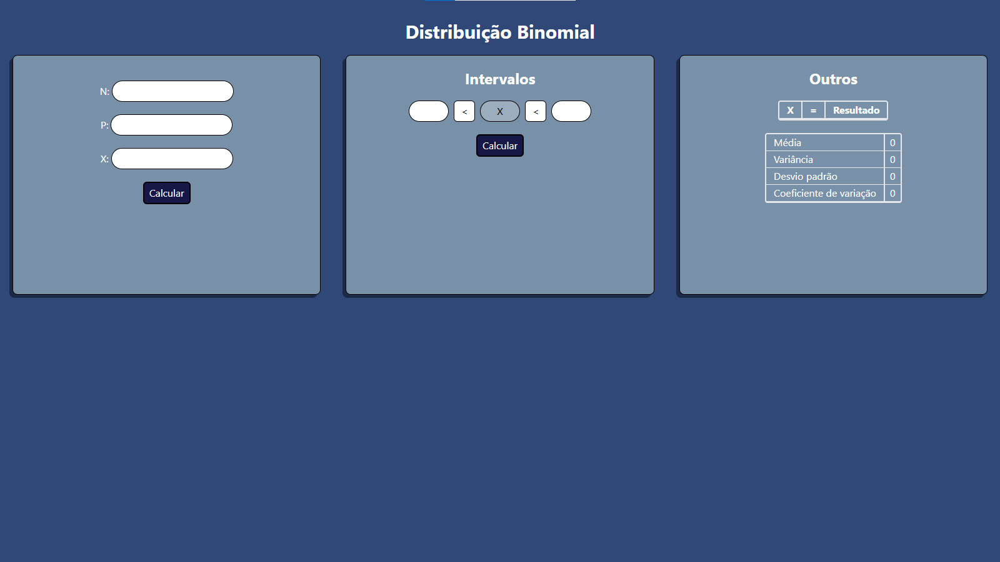

# Calculadora de Distribuição Binomial



> O site consiste em uma calculadora de distribuição binomial realizado para a disciplina de estatítica na FATEC Jundiaí

## 💻 Pré-requisitos

Antes de começar, verifique se você atendeu aos seguintes requisitos:

- Versão mais recente do `Node.js`

## 🚀 Instalando distribuicao_binomial

Para executar o projeto, siga estas etapas:

Com o terminal aberto, copie e cole os seguintes comandos:

```
git clone https://github.com/otaviozin/distribuicao_binomial.git
```
```
cd distribuicao_binomial
```
```
npm install
```
Por fim, você pode executar o projeto no modo desenvolvimento:
```
npm run dev
```

- Não foi testado em sistemas Linux e MacOS, mas acredito que seja o mesmo procedimento por se tratar de um projeto Next.js

## ☕ Usando o projeto

Para usar em modo de produção, siga estas etapas:
 - Faça os procedimentos de instalação acima
 - Após isso, digite os seguintes comandos na raíz do projeto:
```
npm run buid
```
```
npm start
```

## 🤝 Colaboradores

Agradecemos às seguintes pessoas que contribuíram para este projeto:

<table>
  <tr>
    <td align="center">
      <a href="https://github.com/otaviozin" title="otaviozin">
        <br>
        <sub>
          <b>otaviozin</b>
        </sub>
      </a>
    </td>
    <td align="center">
      <a href="https://github.com/Gust4avo" title="Gust4avo">
        <br>
        <sub>
          <b>Gust4avo</b>
        </sub>
      </a>
    </td>
    <td align="center">
      <a href="https://github.com/iurilin" title="iurilin">
        <br>
        <sub>
          <b>iurilin</b>
        </sub>
      </a>
    </td>
  </tr>
</table>

## 📝 Licença

Esse projeto está sob licença. Veja o arquivo [LICENSE](LICENSE) para mais detalhes.
